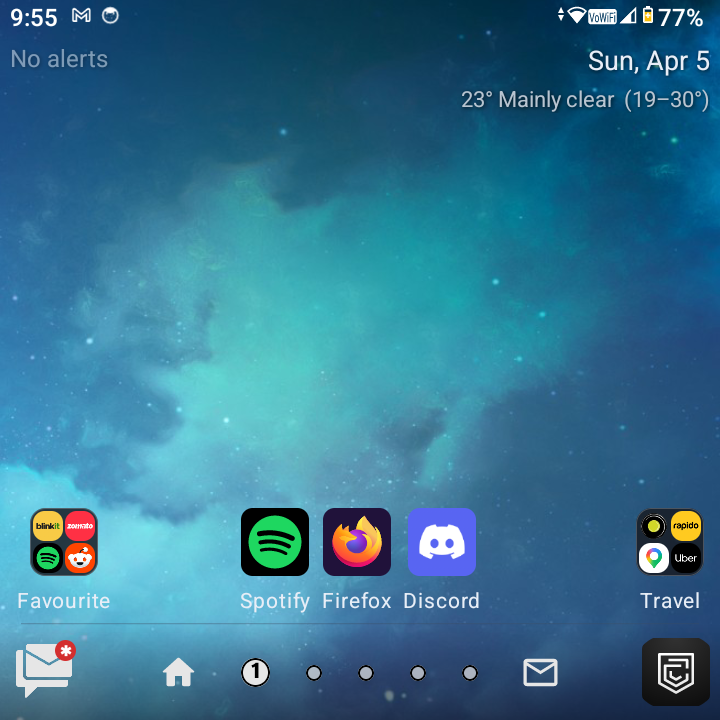
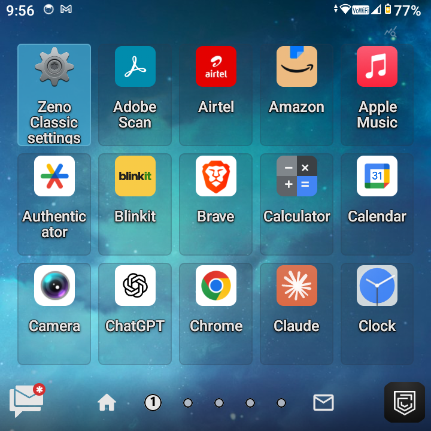
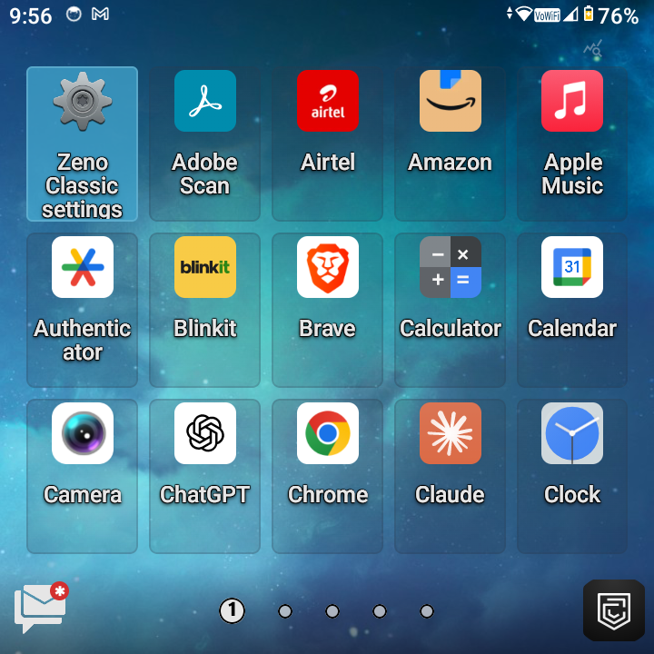

# Zeno Classic Launcher

Native **Android home app** (launcher) built with **Jetpack Compose**, tuned for **square, keyboard-first phones**—especially the **Zinwa Q25** (720×720, physical QWERTY and navigation keys). It is designed to be set as the **default home** (`HOME` / `DEFAULT`) and works best with **BlackBerry-style** workflows: paged drawer, dock, optional glance strip, and D-pad / trackpad-friendly focus. Behavior on tall slab phones may differ.

**Not regularly tested on:** Unihertz Titan / Titan Elite (similar form factors may work but are unverified).

---

## Screenshots

| Home | App drawer | App drawer (classic) |
|------|------------|----------------------|
|  |  |  |

*Sample UI; apps and wallpaper are illustrative.*

---

## Releases

[](https://github.com/faisal-ops/zeno-classic-launcher/releases)
[](https://github.com/faisal-ops/zeno-classic-launcher/releases/latest)

**Install:** open **[Latest release](https://github.com/faisal-ops/zeno-classic-launcher/releases/latest)** and download the attached APK (e.g. **`Zeno Classic.apk`** for **v1.2.0**).  
All releases: [github.com/faisal-ops/zeno-classic-launcher/releases](https://github.com/faisal-ops/zeno-classic-launcher/releases).

---

## Features

- **Home + horizontal app drawer** — Themed grid, **folders**, reorder (tap + drag), hidden apps, **`private`** search hint for hidden list
- **Dock** — Mail badge (notification listener or auto/user mail app), home, page dots with scrub, second shortcut (e.g. Messages), customizable end slot (camera / app of choice)
- **Glance strip** — Date, Open‑Meteo **weather** (coarse location), **calendar** instances, optional battery / alarm hints (settings toggles)
- **Settings** — Grid size, gestures, wallpaper sources, **theme JSON**, app icon shape, permissions, haptics, **JSON backup / restore**
- **Hardware & keyboard** — D-pad / arrow navigation, focus between home and drawer, search key handling where the device exposes it
- **Notification listener** (optional) — Unread styling for dock mail badge (`BadgeNotificationListener`)
- **Device admin** (optional) — Sleep / lock policies where enabled (`LauncherDeviceAdminReceiver`)
- **Widgets** — Add widgets via system picker from the launcher settings sheet
- **DataStore** — Preferences + versioned backup format

## Technical details

| Item | Value |
|------|--------|
| **Language** | Kotlin |
| **UI** | Jetpack Compose |
| **`applicationId`** | `com.zeno.classiclauncher.nlauncher` |
| **Version** | **1.2.0** (`versionCode` **5**) |
| **Min SDK** | **26** (Android 8.0) |
| **Target SDK** | 34 |
| **Release APK filename** | `Zeno Classic.apk` (see `app/build.gradle.kts` `outputFileName`) |
| **Theme** | JSON-driven palette (`LauncherThemePalette`); import/export in settings |

## Permissions (high level)

| Permission | Purpose |
|------------|---------|
| `INTERNET` | Weather (Open‑Meteo), network-backed features |
| `ACCESS_COARSE_LOCATION` | Approximate location for weather |
| `READ_CALENDAR` | Glance strip calendar instances |
| `VIBRATE` | Haptic / vibration where enabled in settings |
| `SET_WALLPAPER` | Apply wallpapers from the app |
| `WRITE_EXTERNAL_STORAGE` (`maxSdkVersion` 28) | Legacy optional export to public Pictures (ignored on API 29+) |
| `PACKAGE_USAGE_STATS` | Optional **most-used** app ordering (special access; `tools:ignore` in manifest for protected permission) |

**Services / special roles (no `uses-permission` entry):**

| Component | Role |
|-----------|------|
| **Notification listener** (`BadgeNotificationListener`) | User enables in system settings; used for dock mail-style badge |
| **Device admin** (`LauncherDeviceAdminReceiver`) | Optional; user enables for sleep / policy features |

Exact declarations are in `app/src/main/AndroidManifest.xml` and runtime flows in the app (e.g. special-access grants for usage stats).

## Build

Use **JDK 17** and Android Studio’s **embedded JDK** for Gradle (`JAVA_HOME` pointing at Android Studio’s JBR where applicable).

### Debug

```bash
./gradlew :app:assembleDebug
```

APK: `app/build/outputs/apk/debug/Zeno Classic-debug.apk`

### Release (signed)

1. Add **`key.properties`** at the **repository root** (never commit secrets). See `app/build.gradle.kts` for `storeFile`, `storePassword`, `keyPassword`, `keyAlias`.
2. Build:

```bash
./gradlew :app:assembleRelease
```

APK: `app/build/outputs/apk/release/Zeno Classic.apk`

```bash
adb install -r "app/build/outputs/apk/release/Zeno Classic.apk"
```

Or install via Gradle (uses `adb` under the hood):

```bash
./gradlew :app:installRelease
```

## Tested devices

| Device | Display | Notes |
|--------|---------|--------|
| **Zinwa Q25** | 720×720 | Primary target |

## Contributing

Issues and pull requests are welcome. Follow AGENTS.md for JDK, release builds, and device install expectations when changing code.
