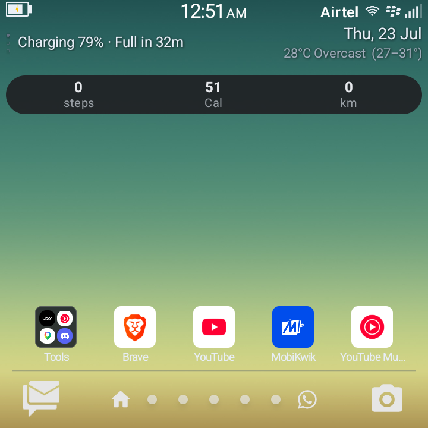
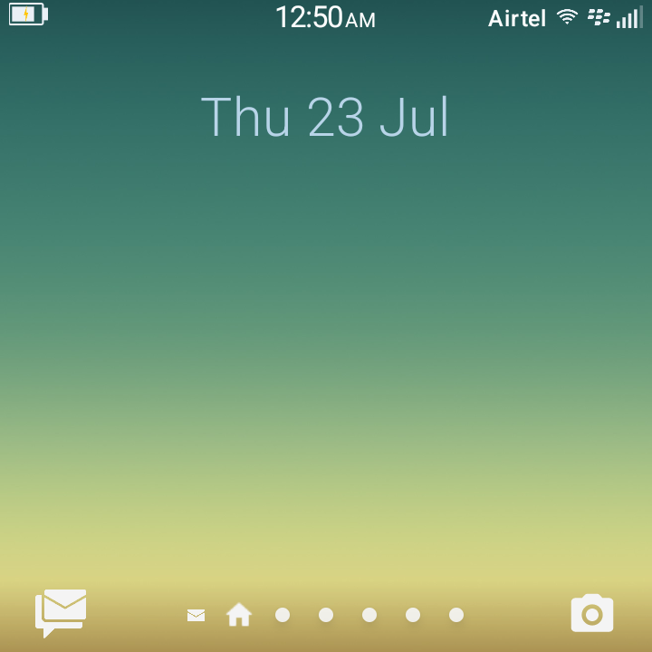
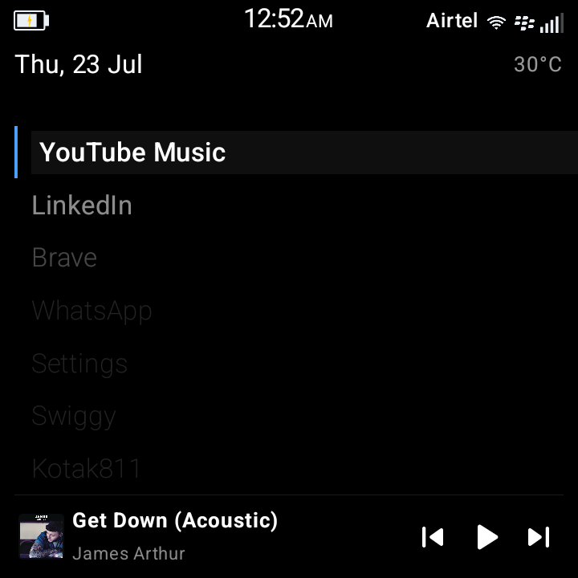
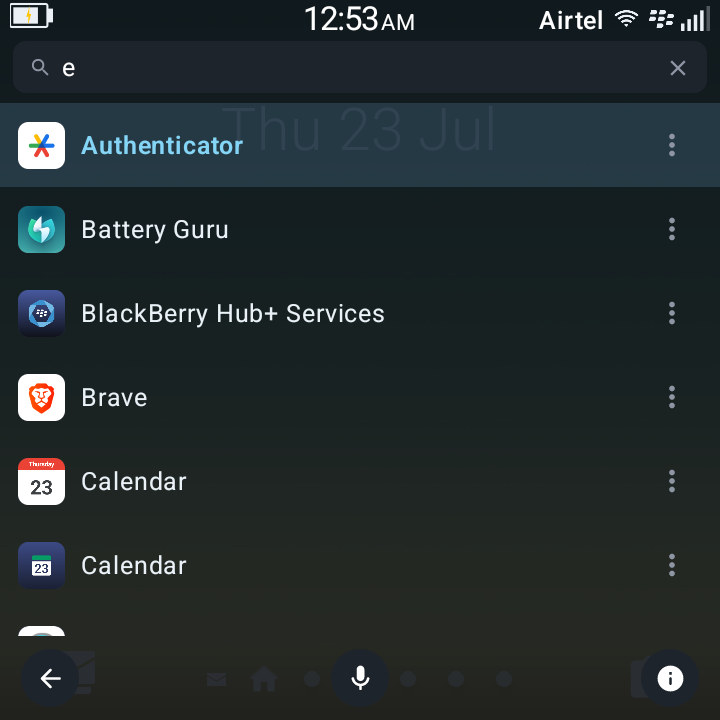
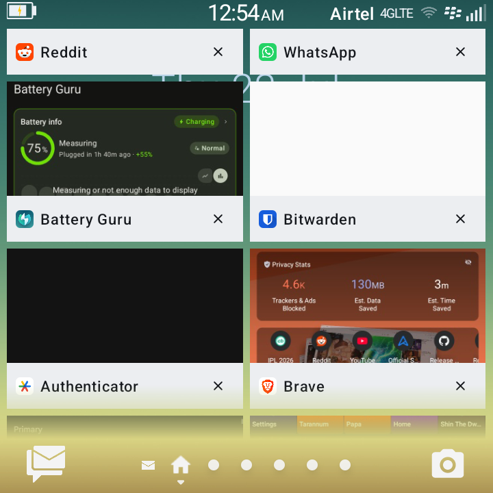
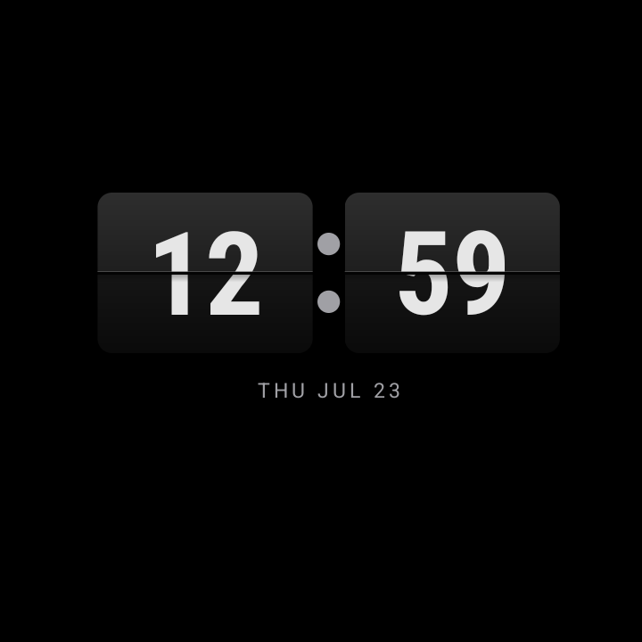

# Zeno Classic Launcher

[](https://ko-fi.com/buildwithzeno)

Native **Android home app** (launcher) built with **Jetpack Compose**, tuned for **square, keyboard-first phones** - especially the **Zinwa Q25** (720x720, physical QWERTY and navigation keys). It is designed to be set as the **default home** (`HOME` / `DEFAULT`) and works best with **BlackBerry-inspired** workflows: paged drawer, dock, launcher Quick Settings, glance strip, compact labels, and D-pad / trackpad-friendly focus. Behavior on tall slab phones may differ.

**Not regularly tested on:** Unihertz Titan / Titan Elite (similar form factors may work but are unverified).

---

## Screenshots

| Zeno Mode | Classic Mode | Minimal Mode |
|-----------|--------------|---------------|
|  |  |  |

| Universal Search | Zeno Recent Apps (Classic Mode) | Flip-clock screensaver |
|-------------------|----------------------------------|--------------------------|
|  |  |  |

*Sample UI; apps and wallpaper are illustrative.*

---

## Releases

[](https://github.com/faisal-ops/zeno-classic-launcher/releases)
[](https://github.com/faisal-ops/zeno-classic-launcher/releases/latest)

**Install:** open **[Latest release](https://github.com/faisal-ops/zeno-classic-launcher/releases/latest)** and download the attached APK.  
All releases: [github.com/faisal-ops/zeno-classic-launcher/releases](https://github.com/faisal-ops/zeno-classic-launcher/releases).

---

## Features

- **Zeno Recent Apps** (root only) — BlackBerry-inspired recent-apps grid with live thumbnails; swipe down or long-press the Classic Mode dock's Home icon to open it, swipe a tile to close that app (removed from Android's real recents too, not just this screen) or exit straight to the drawer
- **Universal Search** — One unified search implementation shared across the drawer, home, and Quick Switch, with app/contact/settings results, hidden-apps access, and full long-press context menu support everywhere results appear
- **Quick Switch** — App-row long-press menu with full parity to the home/drawer context menu (open, app info, hide, change icon)
- **Home + horizontal app drawer** — Themed grid, **folders**, reorder (tap + drag), hidden apps, search ranking, most-used sorting, and compact BlackBerry-inspired app labels
- **Launcher Quick Settings** — Swipe-down QS overlay with keyboard mode, internet, Bluetooth, QR scanner, battery, torch, DND, storage, hotspot, night light, rotate, NFC, cast, and more where supported by the device
- **QS customization** — Pick the QR scanner app, long-press tiles for settings/actions, drag to rearrange tiles, reset tile order, and persist changes automatically
- **Dock** — Mail badge (notification listener or auto/user mail app), home/page dots with scrub, optional second shortcut, configurable mail/messages/camera-style dock targets, **custom icon override per dock slot**, and proportional sizing that scales with screen width
- **Glance strip** — Date, Open-Meteo **weather** (coarse location), **calendar** instances, optional battery / alarm hints, and localized glance text
- **Minimal Mode** — Distraction-free home screen with a BlackBerry-inspired status bar (carrier, signal, battery, in-call indicator), now-playing bar with responsive play/pause, app list, greyscale, per-app daily limits with biometric auth, and BlackBerry-inspired quick settings via swipe-down
- **Modes sub-menu** — Switch between Zeno, Classic, and Minimal from Settings; BiometricPrompt auth gate to exit Minimal Mode
- **Root features & BlackBerry-inspired QS** — Root detection, updated BlackBerry-inspired quick settings for rooted and non-rooted devices, and full root grant/revoke flow
- **Settings** — Grid size, gestures, home strip, icon layout, theme JSON, app icon shape, dock shortcuts, permissions, haptics sub-menu (toggle + intensity slider), language, and **JSON backup / restore**
- **Hardware & keyboard** — D-pad / trackpad navigation with **smart focus visibility** (highlight appears only while trackpad is in use, auto-hides after 2 s), search key handling, haptic navigation, and keyboard-first edit flows
- **Auto Unlock** — On screen-on, skips the "tap to unlock" overlay and auto-submits PIN after 4 digits (physical keyboard; toggle in Settings → Permissions)
- **Sound profiles** — Ring, Vibrate, and DND selector with system-aware fallbacks
- **Localization** — App/settings/glance strings for English plus German, Spanish, French, Hindi, Indonesian, Italian, Japanese, Korean, Portuguese, Russian, and Chinese
- **Notification badges** — Single toggle controls both dock and drawer badges; stuck badge fix (Gmail/Outlook group summaries excluded)
- **Custom app icons** — Long-press any app or dock shortcut → "Change icon" to pick from gallery; "Reset icon" to restore default
- **Notification listener** (optional) — Unread styling for dock mail badge (`BadgeNotificationListener`)
- **Widgets** — Add widgets via system picker from the launcher settings sheet
- **Flip-clock screensaver** — Optional Daydream/screensaver mode with a large flip clock
- **DataStore** — Preferences + versioned backup format

## Technical details

| Item | Value |
|------|--------|
| **Language** | Kotlin |
| **UI** | Jetpack Compose |
| **`applicationId`** | `com.zeno.classiclauncher.nlauncher` |
| **Version** | **1.6.0** (`versionCode` **28**) |
| **Min SDK** | **26** (Android 8.0) |
| **Target SDK** | 35 |
| **Release APK filename** | `zeno-classic-launcher-vX.Y.Z.apk` (see `app/build.gradle.kts` `outputFileName`) |
| **Theme** | JSON-driven palette (`LauncherThemePalette`); import/export in settings |

## Permissions (high level)

| Permission | Purpose |
|------------|---------|
| `INTERNET` | Weather (Open‑Meteo), network-backed features |
| `ACCESS_COARSE_LOCATION` | Approximate location for weather |
| `ACCESS_FINE_LOCATION` | Optional precise Wi-Fi name / weather-related flows where Android requires it |
| `READ_CALENDAR` | Glance strip calendar instances |
| `READ_CONTACTS` | Contact results in Universal Search |
| `CALL_PHONE` | Calling a contact directly from search results |
| `READ_PHONE_STATE` | Cellular signal bars in the status bar (Minimal / Classic Mode) |
| `ACCESS_NETWORK_STATE` / `ACCESS_WIFI_STATE` / `CHANGE_WIFI_STATE` | Network/Wi-Fi state for the status bar and Quick Settings tiles |
| `BLUETOOTH_CONNECT` / `BLUETOOTH` (`maxSdkVersion` 30) / `BLUETOOTH_ADMIN` (`maxSdkVersion` 30) | Bluetooth tile state/settings |
| `BLUETOOTH_PRIVILEGED` | Root-granted; lets the Bluetooth tile toggle as the app's own attributed UID instead of an anonymous root shell call |
| `WRITE_SETTINGS` | Optional keyboard mode / auto-rotate style system-setting actions |
| `ACCESS_NOTIFICATION_POLICY` | Optional DND / sound profile behavior |
| `VIBRATE` | Haptic / vibration where enabled in settings |
| `SET_WALLPAPER` | Apply wallpapers from the app |
| `STATUS_BAR` | Root-granted; lets the custom status bar draw correctly in its reserved space |
| `SYSTEM_ALERT_WINDOW` | Custom status bar overlay (root-granted via app-ops) |
| `WRITE_EXTERNAL_STORAGE` (`maxSdkVersion` 28) | Legacy optional export to public Pictures (ignored on API 29+) |
| `PACKAGE_USAGE_STATS` | Optional **most-used** app ordering (special access; `tools:ignore` in manifest for protected permission) |

**Services / special roles (no `uses-permission` entry):**

| Component | Role |
|-----------|------|
| **Notification listener** (`BadgeNotificationListener`) | User enables in system settings; used for dock mail-style badge |
| **Accessibility service** (`LockScreenAccessibilityService`) | Optional; powers Auto Unlock (auto-submit PIN on screen-on) and the global search-overlay key trigger |
| **Dream service** (`FlipClockDreamService`) | Optional flip-clock screensaver, selectable from Android's Daydream settings |

Exact declarations are in `app/src/main/AndroidManifest.xml` and runtime flows in the app (e.g. special-access grants for usage stats).

## Build

Use **JDK 17** and Android Studio’s **embedded JDK** for Gradle (`JAVA_HOME` pointing at Android Studio’s JBR where applicable).

### Debug

```bash
./gradlew :app:assembleDebug
```

APK: `app/build/outputs/apk/debug/Zeno Classic-debug.apk`

### Release (signed)

1. Add **`key.properties`** at the **repository root** (never commit secrets). See `app/build.gradle.kts` for `storeFile`, `storePassword`, `keyPassword`, `keyAlias`.
2. Build:

```bash
./gradlew :app:assembleRelease
```

APK: `app/build/outputs/apk/release/zeno-classic-launcher-vX.Y.Z.apk`

```bash
adb install -r app/build/outputs/apk/release/zeno-classic-launcher-vX.Y.Z.apk
```

Or install via Gradle (uses `adb` under the hood):

```bash
./gradlew :app:installRelease
```

## Tested devices

| Device | Display | Notes |
|--------|---------|--------|
| **Zinwa Q25** | 720×720 | Primary target |

## Contributing

Issues and pull requests are welcome. Follow CLAUDE.md for JDK, release builds, and device install expectations when changing code.
